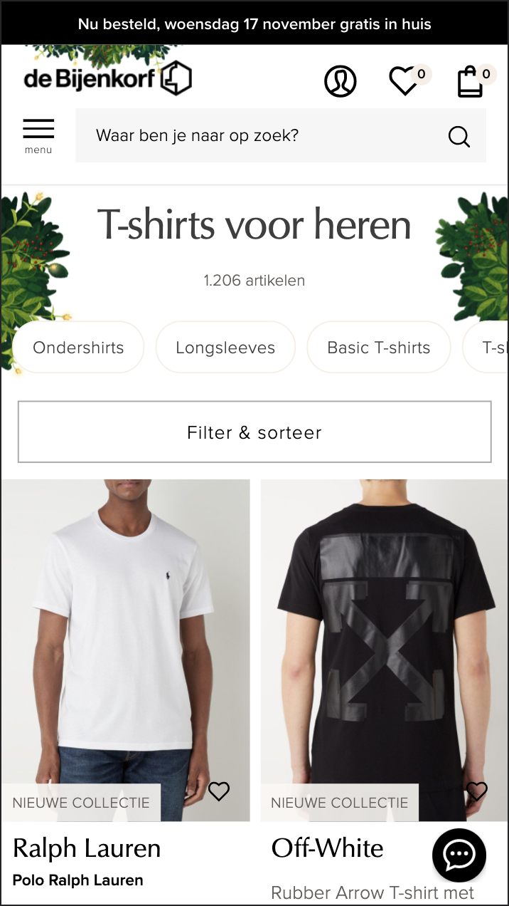
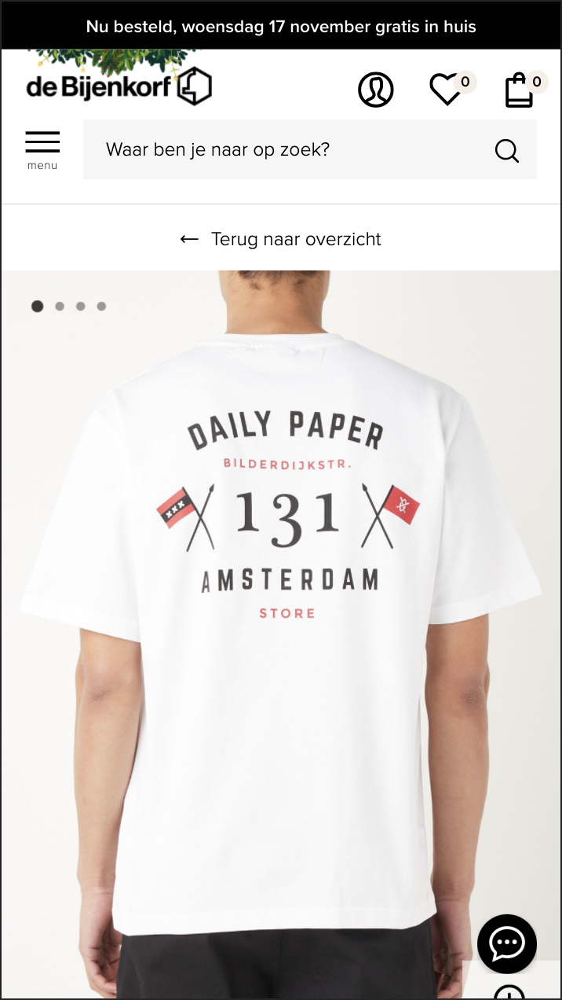
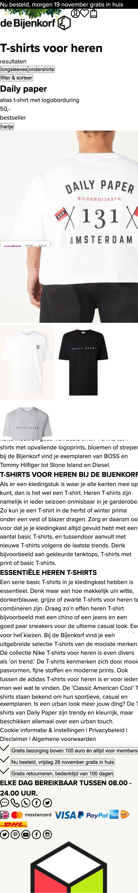
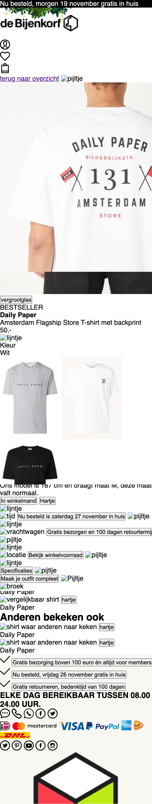
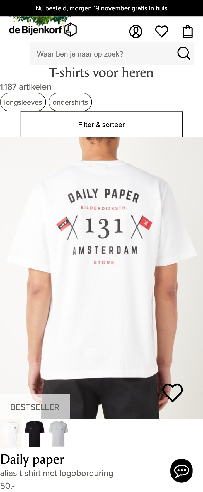

# Procesverslag
Markdown is een simpele manier om HTML te schrijven.  
Markdown cheat cheet: [Hulp bij het schrijven van Markdown](https://github.com/adam-p/markdown-here/wiki/Markdown-Cheatsheet).

Nb. De standaardstructuur en de spartaanse opmaak van de README.md zijn helemaal prima. Het gaat om de inhoud van je procesverslag. Besteedt de tijd voor pracht en praal aan je website.

Nb. Door *open* toe te voegen aan een *details* element kun je deze standaard open zetten. Fijn om dat steeds voor de relevante stuk(ken) te doen.

## Jij

uitwerken voor kick-off werkgroep

### Auteur:
Dennis de Graaf

#### Je startniveau:
blauw

#### Je focus:
surface plane
 

## Je website

uitwerken voor kick-off werkgroep

### Je opdracht:
https://www.debijenkorf.nl/

#### Screenshot(s) van de eerste pagina (small screen): 
heren t-shirts

#### Screenshot(s) van de tweede pagina (small screen):
daily paper shirt 

 

## Breakdownschets (week 1)

uitwerken na afloop 2e werkgroep

### de hele pagina: 

### dynamisch deel (bijv menu): 

### wellicht nog een dynamisch deel (bijv filter): 

## Voortgang 1 (week 2)

uitwerken voor 1e voortgang

### Stand van zaken
Ik had moeite om alle content te verzamelen. Ik ben een tijd bezig geweest om te zoeken naar manieren om de afbeeldingen en iconen te kunnen downloaden. Ik heb mijn HTML voor een groot deel af, alleen nog enkele afbeeldingen/iconen erin zetten en de nav. Styling ben ik nog niet aan toegekomen.

### Agenda voor meeting
samen met je groepje opstellen

| student 1      | student 2          | student 3    | student 4        |
| ---            | ---                | ---          | ---              |
| dit bespreken  | en dit             | en ik dit    | en dan ik dat    |
| en dat ook nog | dit als er tijd is | nog een punt | dit wil ik zeker |
| ...            | ...                | ...          | ...              |

### Verslag van meeting
hier na afloop snel de uitkomsten van de meeting vastleggen

- HTMl zag er goed uit
- beginnen aan de styling, vooral focus op de header
- nog een punt
- ...

## Voortgang 2 (week 3)

uitwerken voor 2e voortgang

### Stand van zaken
Deze week was ik begonnen met de styling. Tijdens het stylen moest ik regelmatig nog mijn html veranderen wat best wat tijd kostte. Ik had soms nog moeite met dingen op een bepaalde plek krijgen en standaard styling verwijderen. Verder bleef ik lang hangen bij hoe ik het menu zou moeten maken. Dit heb ik voor nu overgeslagen en ik ben van boven naar beneden bezig met stylen. Deze week loop ik iets achter omdat ik het nog lastig vind.

### Agenda voor meeting
samen met je groepje opstellen

| student 1      | student 2          | student 3    | student 4        |
| ---            | ---                | ---          | ---              |
| nav            | en dit             | en ik dit    | en dan ik dat    |
| pop-upps       | dit als er tijd is | nog een punt | dit wil ik zeker |
| html           | ...                | ...          | ...              |

### Verslag van meeting
hier na afloop snel de uitkomsten van de meeting vastleggen

- nav maken
- geen buttons maar a
- geen %
- time tag
- list in de footer

## Toegankelijkheidstest (week 4)

uitwerken na test in 8e voortgang

### Bevindingen
Lijst met je bevindingen die in de test naar voren kwamen:

#### alt tekst
Ik heb veel engelse teksten gebruikt terwijl het een nederlandse pagina wordt dus ja... In het engels werken gaat voor mij makkelijker dus hier had ik niet over nagedacht. Dus ik ga nog langs alle alt teksten.

#### Geen knoppen of links 
De screenreader las bijvoorbeeld het winkelmandje als een list item dus dit moet ik gaan veranderen. Ook bij social media iconen en manieren om contact te zoeken las hij deze als list item. Ook kwam ik erachter dat hij elk artikel wel goed uitleest en ook op de goede volgorde, alleen gaf hij niet aan dat je erop kon klikken. Dus hier moet ook nog een a omheen gewrapt worden

 
#### achtergrond footer
toen we de tests met de brillen deden was het contrast van de achtergrond van de pagina en de footer amper tot niet te zien. Ook ik heb hier tijdens het coderen wel eens last van gehad terwijl ik geen beperkingen heb. Ik weet niet of ik dit moet veranderen, want het is wel hun eigen stijl.

## Voortgang 3 (week 4)

uitwerken voor 3e voortgang

### Stand van zaken
Ik loop op dit moment een beetje achter. De eerste pagina is bijna klaar. Ik moet nog een paar kleine dingen stylen, elementen veranderen en de nav maken. Voor de 2e pagina heb ik alleen de html en nog niet de styling.
 

### Agenda voor meeting
samen met je groepje opstellen

| student 1      | student 2          | student 3    | student 4        |
| ---            | ---                | ---          | ---              |
| slider?        | en dit             | en ik dit    | en dan ik dat    |
|                | dit als er tijd is | nog een punt | dit wil ik zeker |
| ...            | ...                | ...          | ...              |

### Verslag van meeting
hier na afloop snel de uitkomsten van de meeting vastleggen

- punt 1
- punt 2
- nog een punt
- ...

## Eindgesprek (week 5)

uitwerken voor eindgesprek

### Stand van zaken
hier dit ging goed & dit was lastig (neem ook screenshots op van delen van je website en code)

### Screenshot(s)

hier screenshot(s) van je eindresultaat

## Bronnenlijst

continu bijhouden terwijl je werkt

Nb. Wees specifiek ('css-tricks' als bron is bijv. niet specifiek genoeg).

1. bron 1
2. bron 2
3. ...

